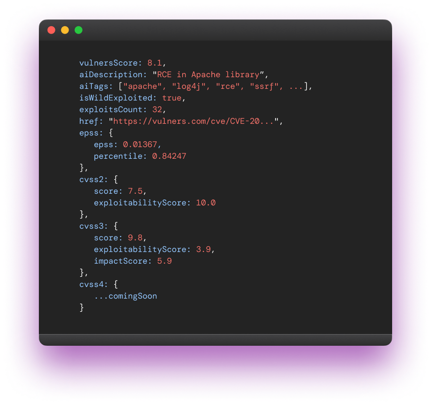

# trivy-plugin-vulners-db

Enchance Trivy security scanner with vulners.com database with AI based vulnerability scoring, exploit prediction, analytics and more:

- **vulnersScore** - [AI based](https://vulners.com/blog/ai-score/) vulnerability score
- **epss** - [Exploit Prediction Scoring System](https://vulners.com/blog/epss-exploit-prediction-scoring-system/) score
- **cvss2**, **cvss3** - CVSS v2 and v3 [scores](https://vulners.com/blog/cvss-common-vulnerability-scoring-system/)
- **aiDescription** - Shortened vulnerability description
- **aiTags** - Tags showing vulnerability types, vendor and product names
- **isWildExploited** - known facts of vulnerability exploited in the wild
- **exploitsCount** - number of known exploits for vulnerability
- **href** - link to vulnerability page on vulners.com

## Installation

- Install plugin using trivy plugin command

`trivy plugin install github.com/vulnersCom/trivy-plugin-vulners-db`

- Download vulners enriched database using [vulners api-key](https://vulners.com/userinfo?tab=api-keys)

`trivy vulners-db --api-key <vulners api-key>`

## So, enjoy enriched database

For example try this out

`trivy image python:3.4-alpine -f json`

